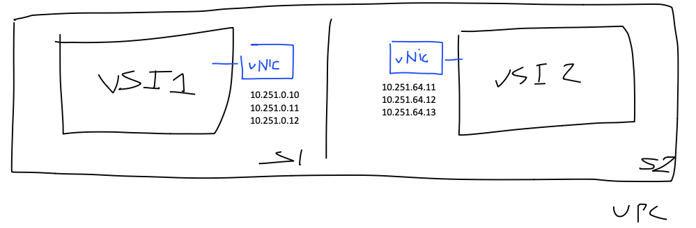
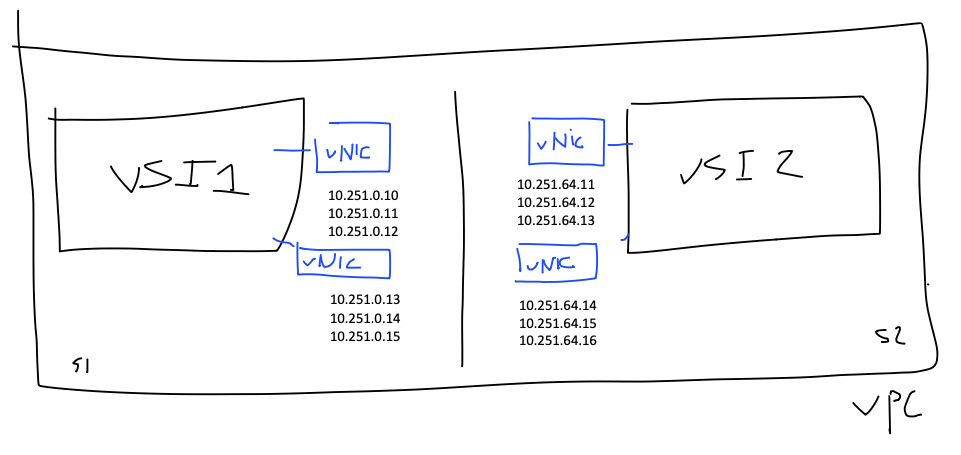

# Introduction
This repo tries to show the capabilities of vNIC terraform module

# Provider installation (v1.59.0-vnip2)
Following steps are valid for macOS!. If you are in other system try to find the equivalent steps.
Because of package are been provided manually we need to do the following to install it. 

Create some need variables
```bash
export URL_PROVIDER=https://github.com/ibm-vpc-official/terraform-provider-ibm/releases/download/v1.59.0-vnip2.1/terraform-provider-ibm_1.59.0-vnip2.1_darwin_arm64.zip
export PLUGIN_DIRECTORY=~/.terraform.d/plugins/terraform-stratus.com/ibm-cloud/ibm/1.59.0-vnip2.1/darwin_arm64
```
Create directory and unzip binary
```bash
mkdir -p $PLUGIN_DIRECTORY
wget $URL_PROVIDER -P $PLUGIN_DIRECTORY
unzip $PLUGIN_DIRECTORY/terraform-provider-ibm_1.59.0-vnip2.1_darwin_arm64.zip -d $PLUGIN_DIRECTORY
rm -rf $PLUGIN_DIRECTORY/terraform-provider-ibm_1.59.0-vnip2.1_darwin_arm64.zip.1
```
# Execute it
```bash
terraform init
terraform plan -out plan.out
terraform apply plan.out
```

# Important considerations

**Aliases at OS level must be created manually**

What does it means? It means that if you create a vNIC with 2 secondary IP's, the OS won't be aware of those IP's 
```
You are responsible for configuring the same secondary IP addresses on the interfaces in the guest operating system of your instances or bare metal servers to ensure the addresses take effect.
```

**Do we need to create aliases in our terraform example**

NO!. It is been covered in the file ```userdata.sh```

# What will be deployed?
* VPC
* 2 Subnets in two AZ's
* 2 Public Gateway
* 4 Floating IP's
* 6 vNIC
* 18 Reserved IP's
* 4 VSI (image ```ibm-centos-7-9-minimal-amd64-11```)

We wanted to test the following scenarios

## 1 VSI with 1 vNIC ping to 1 VSI with 2 vNIC

### How to create alias in Linux
```bash
sudo ip addr add 10.251.0.7 dev eth0
```
### How to create alias in Windows
Is importart to set the primary ip like ```fixed``` (Control Panel > Network and Internet > Network Connections > Ethernet Properties)
```bash
netsh interface ip add address "Ethernet" 10.251.0.7 255.255.255.255
```

## 1 VSI with 2 vNIC ping to 1 VSI with 2 vNIC

In this configuration first vNIC of first VSI is capable to talk with the first VSI in the second VSI. However this couldn't be done with the seconds vNIC. This is cover here for NIC's
https://cloud.ibm.com/docs/vpc?topic=vpc-using-instance-vnics

The reason behind that is that when you send TCP packages to a dev you expect that returning packages comes from the same device. If you are in this scenario you will have to adopt some of the following solutions

There are two solutions

### Solution 1. Configuring in the main route table
VSI1
```bash
ip route add 10.251.64.14/32 via 10.251.0.1 dev eth1
ip route add 10.251.64.15/32 via 10.251.0.1 dev eth1
ip route add 10.251.64.16/32 via 10.251.0.1 dev eth1
```
VSI2
```bash
ip route add 10.251.0.13/32 via 10.251.64.1 dev eth1
```
Traffic reach out to VSI2 from primary ip in the eth1 vNIC

### Solution 2. Configuring in another route table
VSI 1
```bash
echo 201 eth1tab >> /etc/iproute2/rt_tables
ip route add 10.251.0.0/24 dev eth1 proto kernel scope link src 10.251.0.10 table eth1tab
ip route add default via 10.251.0.1 dev eth1 table eth1tab
ip rule add from 10.251.0.14 table eth1tab
ip rule add from 10.251.0.15 table eth1tab
ip rule add from 10.251.0.16 table eth1tab
```
VSI 2
```bash
echo 201 eth1tab >> /etc/iproute2/rt_tables
ip route add 10.251.64.0/24 dev eth1 proto kernel scope link src 10.251.64.14 table eth1tab
ip route add default via 10.251.64.1 dev eth1 table eth1tab
ip rule add from 10.251.64.14 table eth1tab
ip rule add from 10.251.64.15 table eth1tab
ip rule add from 10.251.64.16 table eth1tab
```

# OS where we have tested
* ibm-windows-server-2016-full-standard-amd64-15
* ibm-windows-server-2019-full-standard-amd64-15
* ibm-centos-7-9-minimal-amd64-11
* ibm-redhat-8-6-minimal-amd64-6

# Utils
### TCPDUMP en Windows
Use pktmon to filter ICMP packages. Available in Windows 10 has pktmon since a 2018 release.
```bash
pktmon filter add -t ICMP
pktmon start --etw -m real-time
```
### Userdata powershell
You need to enable ```dhcpstaticipcoexistence=enabled``` config to dev to allow coexists dhpc and fixed ip on Windows. Only enable in Win 2019. No Win 2016.
```powershell
#ps1_sysnative
netsh interface ipv4 set interface interface="Ethernet" dhcpstaticipcoexistence=enabled
netsh interface ip add address "Ethernet" 10.251.64.11 255.255.255.255
netsh interface ip add address "Ethernet" 10.251.64.12 255.255.255.255
```

# References
* https://test.cloud.ibm.com/docs/vpc?topic=vpc-vni-about-secondary-ip&interface=ui
* https://cloud.ibm.com/docs/vpc?topic=vpc-using-instance-vnics
* https://github.com/ibm-vpc-official/terraform-provider-ibm/releases/tag/v1.59.0-beta0-vnip2-test